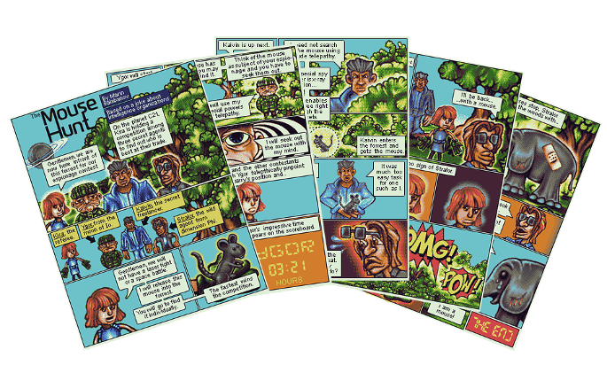

# DUK Pixelart Project Site
Quick Bootstrap site to present project at the _Danube University Krems_. Marin Balabanov creates a pixel art comic on retro hardware.  The objective is to refurbish a thirty year old Atari computer, upgrade it and then - well within the technical constraints of the day - to use it to create a five page comic.

The site's URL is: http://marincomics.com/duk-pixelart/

